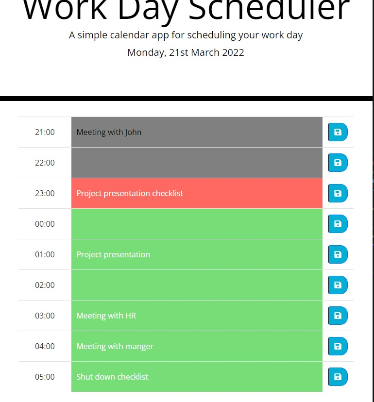

# Work Day Scheduler

## The App
A simple calendar application that allows a user to save events for each hour of today's day. This app runs in a browser which has dynamically updated HTML and CSS powered by jQuery. Localstorage is used to persist data and moment.js to work with time. 

## How it works
- When the page is loaded, we are displayed today's date and a planner for the day. The planner displays each hour of today's working hours, a text box where the user can input an event for the hour and a button to save the event.
- According to the current time, the colour of the timeblocks changes accordingly to the following: 
    1. Past: background changes to gray and text to black
    2. Present: background changes to red and text to white  
    3. Future: background changes to green and text to white
- The event input is disabled if the event is in the past

## Screenshot

## Link
https://bernardjbs.github.io/hw-boot-wk05-Work-Day-Scheduler-Final/
